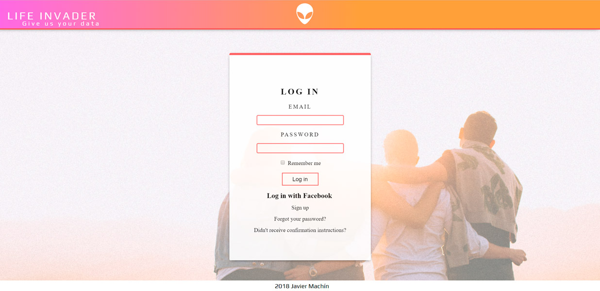
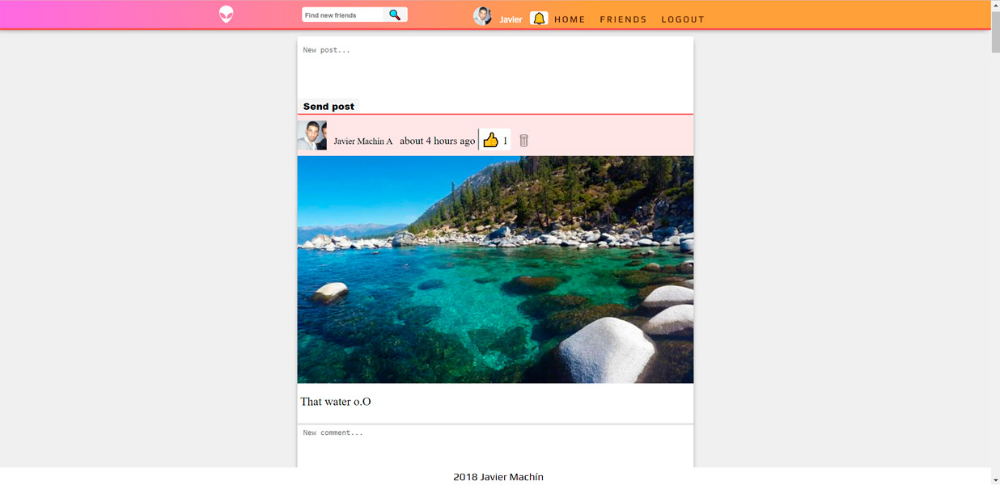

# Life Invader

Life Invader (name from GTA V's parody social network) is a Facebook clone made in Ruby on Rails

Some of its features are:

* Sign up new users (Devise)
* Facebook sing up and log in (OAUTH)
* Send confirmation email (action required)
* Make new posts, allow images
* Make comments
* Update profile picture
* Send friend requests, accept and decline them
* Fully functional friends search
* Responsive design
* Test suite
* Bullet optimized Active Record queries





You can [check it online here](https://life-invader-fb.herokuapp.com) 
It can take a bit to load as Heroku starts a dyno and be patient with the sign up mail, 
it takes a few minutes sometimes.

The database is postgreSQL for development and production.

How to setup postgres:

Installation:

```
sudo apt-get update
sudo apt-get install postgresql postgresql-contrib libpq-dev

```
Creating a postgres database user:

`sudo -u postgres createuser -s pguser` (change pguser to your username)

Setting up a postgres user password:

```
sudo -u postgres psql 
\password pguser 
enter your password
\q
``` 

Using your PG user in Rails:

Set your pg username in `config/database.yml`
Set your password as ENV variable in `config/application.yml` (you might need to create that file, used by Figaro).

Setting up the Rails app:

```
bundle install
rails db:migrate
rails db:seed
rails server
http://localhost:3000/ in your web browser
```
The seeds include 3 example users usable to log in (only development), but they must be confirmed first from console:
```
rails console
User.first.confirm
exit
```
or from the links in the emails that will pop up after seeding, from letter_opener.

* email1@example.com 
  PW: 123456

* email2@example.com 
  PW: 123456

* email3@example.com 
  PW: 123456

  To run the test suite `rails test`

You can find me in https://gitter.im/TheOdinProject/theodinproject  @Javier-Machin
